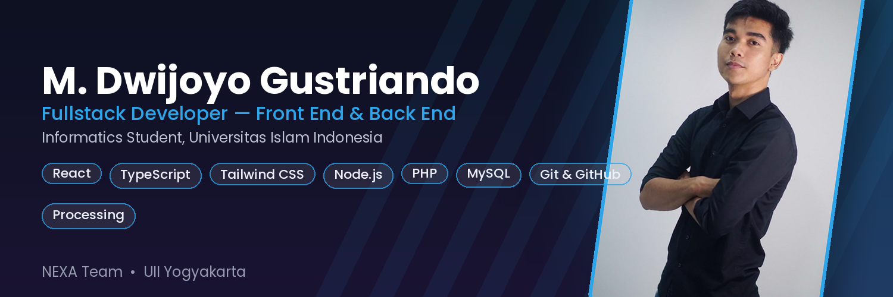

<h1 align="center">Hi , I'm M. Dwijoyo Gustriando</h1>

<h3 align="center">Fullstack Developer | Informatics Student @ Universitas Islam Indonesia</h3>

  

  
  
  

---

###  About Me

- 🎓 Mahasiswa **Teknik Informatika**, Universitas Islam Indonesia (UII), Yogyakarta
- 👥 Saya juga aktif beberapa organisasi Contohnya saya menjabat **Kepala Bidang HUMAS(Hubungan Mahasiswa) Himpunan Mahasiswa Informatika** yang membuat relasi di antara Himpunan di internal yaitu di ruang lingkup uii maupun External di Universitas lain, dan juga menjabat sebagai Koordinator **Koordinator Komisi B Porsematik**,Membuat aturan umum Acara Milad Informatika Uii dan Pekan Olahraga,Seni,dan edukasi.
- 💻 Fokus sebagai **Fullstack Developer** — nyaman bekerja di sisi *frontend* maupun *backend*
- 🚀 Sedang mengembangkan **Yogya Nomad Gateway**, platform web workation berbasis React & TypeScript
- 🎨 Punya minat di bidang kreatif — mengerjakan proyek animasi bertema Islami menggunakan Processing
- 🌱 Terus belajar hal baru seputar pengembangan sistem informasi, arsitektur web modern, dan tooling berbasis AI
- 🤝 Terbuka untuk kolaborasi proyek mahasiswa, riset, maupun proyek open source
- ⚡ Fun fact: salah satu karakter dalam proyek animasi tim saya diberi nama "Joyo" 😄

---

### Tech Stack & Tools

**Frontend**

  
  
  
  
  
  

**Backend & Database**

  
  
  
  
  

**Tools & Others**

  
  
  
  
  
  

---

###  Featured Projects

| Project | Deskripsi | Tech |
|---|---|---|
| **Yogya Nomad Gateway** | Platform web workation untuk kawasan Gunungkidul, dibangun bersama tim NEXA | React, TypeScript, TanStack Router, Tailwind CSS |
| **Skrining Hipertensi** |Sistem Skrining penyakit hipertensi berbasis website | React, TypeScript, TanStack Router, Tailwind CSS|
| **Dakwah Animation Project** | Animasi Islami 4 menit, 6 scene, dengan arsitektur class & timing 60fps | Processing |
| **Monelo** | Website untuk pengeluaran keuangan| full php|
| **Kalori Tracker(kcal-coach-plus )** | Website untuk Kesehatan yang berfokus kepada masa kalori manusia | React, TypeScript, TanStack Router, Tailwind CSS|

---

### 🎮 Contribution Graph

<picture>
  <source media="(prefers-color-scheme: dark)" srcset="https://raw.githubusercontent.com/Joyo13/Joyo13/output/github-snake-dark.svg" />
  
</picture>

---

###  Let's Connect

  Terbuka untuk diskusi seputar pengembangan web, sistem informasi, atau kolaborasi proyek mahasiswa. 
  Jangan ragu untuk menghubungi saya! 🚀

  

